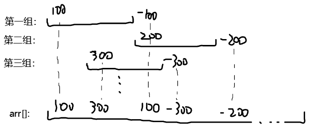

# Array Manipulation

[题目](https://www.hackerrank.com/challenges/crush/problem)  

**输入格式：**  
第一行包含两个整数 N和 M。  
接下来 M行，每行包含3个整数 a, b 和 k。  
**列表中的数位置编号为从1到 N。**  

**含义：**  
N为数组长度  
M为接下来的行数  
a, b, k为数组中a到b区域内全部元素加上k。

# Solution

**实现思路**  

O(M*N)：把所有数加到数组里，最后再遍历一遍找到最大值。这样时间复杂度为O(M*N);  

O(N+M)：  
1. 在一组a, b, k中，只标记arr[a]=k，arr[b+1]= -k; 
2. 最终求取结果时，需从头遍历一遍数组，将每个元素加起来，找求和过程中出现的最大值。
3. 这样设计巧妙在于：在遍历求和[a,b]的过程中，最大值都是k。而一旦在[a,b]外，它的和为k-k=0。这样就能区分并计算出不同区间上重叠区域的最大值。  


**注意点**

**变量设置**  

**实现方式**  
```c
#include <bits/stdc++.h>
using namespace std;

// Complete the arrayManipulation function below.

int main()
{
    int N,M;
    int a, b, k;
    cin >> N >> M;

    long long *arr = new long long[N+1]();

    while (M--) {
        cin >> a >> b >> k;
        arr[a] += k;
        if ((b+1)<=N) arr[b+1] -= k; //(b+1)
    }

    long long max = 0, sum = 0;
    for(int i = 1; i < N+1; i++){ 
        sum += arr[i];
        if(max < sum) max = sum;
    }
    cout << max << endl;

    return 0;
}
```
