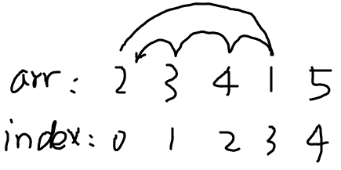

# Minimum Swaps 2

[题目](https://www.hackerrank.com/challenges/minimum-swaps-2/problem?h_l=interview&playlist_slugs%5B%5D=interview-preparation-kit&playlist_slugs%5B%5D=arrays)

题目让我们以尽量少的步数将一个数组恢复为递增序列。可以交换任意两个数字，每交换一次算一步。

# Solutions

**法一**  
从头开始遍历，每次将一个正确的元素交换到当前位置。
```c
int minimumSwaps(vector<int> arr) {
    int count = 0;
    for(int i=0; i<arr.size(); i++){
        int t = i;
        while (arr[t] != i+1){
            t++;
        }
        if(t != i){
            swap(arr[i], arr[t]);
            count++;
        }
    }
    return count;
}
```

**法二**  
1. 思路
若有一个`arr[i]`占着`arr[j]`的位置，那么`arr[j]`又会占着`arr[k]`的位置。  
如图，2占着1的位置，1占4位置，4占3，3又占2，这就形成了一个循环。  


在这个循环内，将`2`与`1、3、4`依次交换，这个循环中的元素就都到了自己的位置上，所需交换步数为`cycle_size-1`，本例中为`4-1=3`。  

2. 实现方式：  
给定一个元素下标`i`，若`arr[i]`位置不正确，找应该在这位置上的元素的下标`j`。同样的，用`j`找`k`，直到形成了一个循环，循环的元素个数为`cycle_size`。得交换次数`cycle_size-1`。

3. 变量设置：
`visited[]`: 用来记录遍历过的循环，以便在遍历数组的过程中能跳过这些已经计算过的、排好序了的循环。  
`idx[]`: `idx[5]`若等于3，表明`a`数组中，元素值为5的数组下标为3。  
```c
int minimum_swap(int n)
{
    int idx[n+1] = {0}; 

    for (int i = 0; i < n; i++){
        idx[a[i]]=i;
    }

    int ans = 0;

    for (int i = 0; i < n; i++) {
        if (visited[i] || a[i]==i+1 )
            continue;

        int cycle_size = 0;
        int j = i;

        //Counting the size of the cycle
        while (!visited[j])
        {
            visited[j] = 1;
            j = idx[j+1]; //看看j占了谁的位置，找到其下标
            cycle_size++;
        }

        ans += (cycle_size - 1);
    }

    return ans;
}
```
