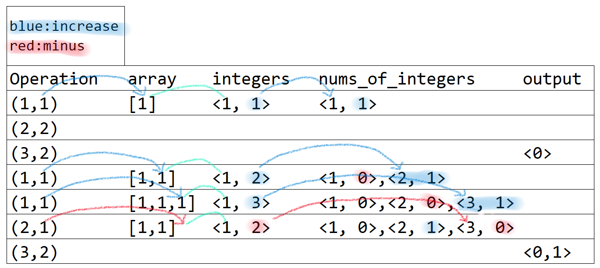

# Frequency Queries

[题目](https://www.hackerrank.com/challenges/frequency-queries/problem)  

## Solution

**实现思路**  
<<<<<<< HEAD
O(n):n为queries的组数  
=======
O(n):
>>>>>>> 9b12c70c540afca5a7c32884193b98c5d6985b3d
* 需要知道指令所操作的数组中整数的出现情况. 并且需要知道执行到某个query的时候, 数组内重复次数最多的整型的次数值.  
* 则需要设置两个unordered_map, 分别为integers和nums_of_integers, 并分别用于满足上面两点需求. integers把queries[i][1]作为key, key的计数作为value, 而nums_of_integers把integers.second作为key, key的计数作为value.
* 当指令为添加元素时, 增加当前元素的计数. 当减小时反之. 注意, 在添加元素前, 要将元素的出现次数的出现次数减一, 添加元素后, 将当前元素的出现次数的出现次数加一. 
* 当指令为删除元素时同理, 需要注意的是若数组内没有要删除的元素, 不需要减小元素计数.

**注意点**  
* 元素个数不为负数

**变量设置**  


**实现方式**  
```c
vector<int> freqQuery(vector<vector<int>> queries) {
    vector<int> output;
    //key : integers
    //value : number of integers
    unordered_map<long, long> integers;
    //key : number of integers
    //value : number of number of integers
    unordered_map<long, long> nums_of_integers;

    for(auto &t:queries){
        int instruct = t[0];
        int tmp_i = t[1];

        nums_of_integers[integers[tmp_i]]--;
        if(instruct == 1) integers[tmp_i]++;
        else if(instruct == 2) {
            if(integers[tmp_i]-1 >= 0){ // can not remove tmp_i if it is not exist
                integers[tmp_i]--;
            }
        }
        nums_of_integers[integers[tmp_i]]++;

        //instruct == 3
        if(instruct == 3) (nums_of_integers[tmp_i] > 0) ? output.push_back(1) : output.push_back(0);
    }
    return output;
}
```
