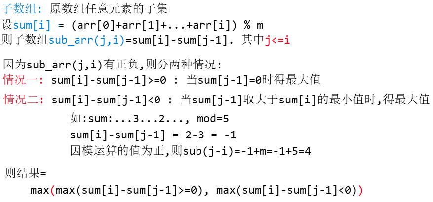

# Maximum Subarray Sum 

[题目](https://www.hackerrank.com/challenges/maximum-subarray-sum/problem)  

## Solution

**实现思路**  
本题求子数组和取模的最大值.



**注意点**  
```c
* 用set专用的lower_bound能提升效率, 原理不知
//Timeout!
//set<ll>::iterator iter = lower_bound(prev.begin(), prev.end(), t+1);
set<ll>::iterator iter = prev.lower_bound(sum+1); //找 >= sum+1 的最小值

* 数组元素值最大10^18,需8字节, 用 long long. mod值用 long long
```

**实现方式**  
```c
#include <bits/stdc++.h>
using namespace std;
typedef long long ll;
ll maximumSum(vector<ll> arr, ll m){
    ll sum = 0; //[0:i]的和 + 取模
    ll maxi = 0;
    set<ll> prev; //已经遍历过的sum
    prev.insert(0); //表示不减任何前面元素的情况

    for(auto t:arr){
        sum = (sum + t)%m ;
        maxi = max(maxi, sum); //情况一: sum[i]-sum[j]>0; 最大值为sum[i]-0

        //Timeout!
        //set<ll>::iterator iter = lower_bound(prev.begin(), prev.end(), t+1);
        set<ll>::iterator iter = prev.lower_bound(sum+1); //找 >= sum+1 的最小值
        if(iter != prev.end()){ //情况二: sum[i]-sum[j]<0; 最大值为min(sum[j])
            maxi = max(maxi, sum-(*iter)+m); // maxi = max(情况一, 情况二)
        }
        prev.insert(sum);
    }
    return maxi;
}

int main(){
    int n;
    cin >> n;

    ll mod;
    long len;
    while(n--){
        cin >> len >> mod;
        vector<ll> arr(len);
        for(long i = 0; i < len; i++){
            cin >> arr[i];
        }
        cout << maximumSum(arr, mod) << endl; // endl;
    }
    return 0;
}
```
