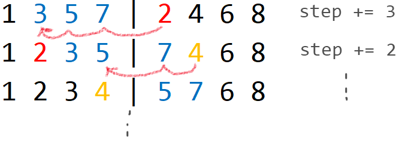

# Merge Sort: Counting Inversions 

[题目](https://www.hackerrank.com/challenges/ctci-merge-sort/problem)  
题目让要求` To correct an inversion, we can swap adjacent elements.`. 这个邻近元素有一定误导性. 本题里的意思是`adjacent inversion elements`, 而不是`adjacent elements`.  

## Solution

**实现思路**  
O(n logn):  
本题考察归并排序, 每趟交换次数 = 前一个数列中大于当前值的元素个数.  



**注意点**  
* 交换次数最多可能: `n*n = 10^5 * 10^5 = 10^10` , 要用8字节的`long long`变量. 题目中自带的返回值是long, 因为它编译器规定long为8字节, 但其他64位编译器就不一定了. 最好是用`long long`

**实现方式**  
```c
long swap_num;
void Merge_sort(vector<int> &arr, int l, int r){
    if(l == r) return;

    int mid = (l+r)/2;
    Merge_sort(arr, l, mid);
    Merge_sort(arr, mid+1, r);

    vector<int> tmp_arr;
    int i = l;
    int j=mid+1;
    while(i <= mid && j <= r){
        if(arr[i] <= arr[j]) tmp_arr.push_back(arr[i++]);
        else {
            tmp_arr.push_back(arr[j++]);
            swap_num += (mid+1 - i);
        }
    }

    while(j <=r) tmp_arr.push_back(arr[j++]);
    while (i <= mid) tmp_arr.push_back(arr[i++]);

    i = l;
    for(auto t:tmp_arr) arr[i++] = t;
}
// Complete the countInversions function below.
long countInversions(vector<int> arr) {
    swap_num = 0; //initiate;
    Merge_sort(arr, 0, arr.size()-1);
    return swap_num;
}
```
