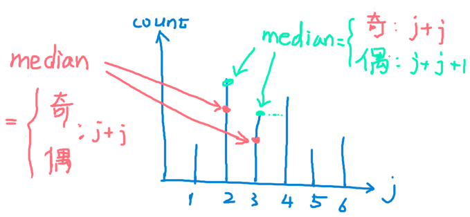

# Fraudulent Activity Notifications 

[题目](https://www.hackerrank.com/challenges/fraudulent-activity-notifications/problem)  

## Solution

**实现思路**  
O(n*d):  
* 若 expenditure[i+d] >=  2 x 中位数, notif_num计数+1;
* 运用count sort存储expenditure的元素个数. 
* 遍历时只需更新expenditure在[i, i+d-1]内开头和结尾元素的计数. 



**注意点** 
* 取偶数中间两个数平均数时, 结果可能为小数. 

**实现方式**
```c
int activityNotifications(vector<int> expenditure, int d) {
    int ev_od_f = d%2;// odd: 1; even: 0;
    int notif_num = 0;
    vector<int> count_arr(201); // position 201 for element "200"

    for(int i = 0;  i < d-1; i++){ // initiate the first d-1 elements.
        count_arr[expenditure[i]]++;
    }

    for(int i = 0; i+d-1 < expenditure.size(); i++){
        count_arr[expenditure[i+d-1]]++; //increase the count of last element.

        int median = 0;
        int half_d = d/2; // half of d
        if(ev_od_f) ++half_d;

        int j = 0;
        for(; j < 200; j++){
            half_d -= count_arr[j];
            if(half_d <= 0) break;
        }

        // 偶 && 计数末尾
        if(half_d == 0 && !ev_od_f) median = j+j+1;
        else median = 2*j;

        if(expenditure[i+d] >= median) notif_num++;
        count_arr[expenditure[i]]--; // decrease the count of first element
    }

    return notif_num;
}
```
