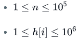
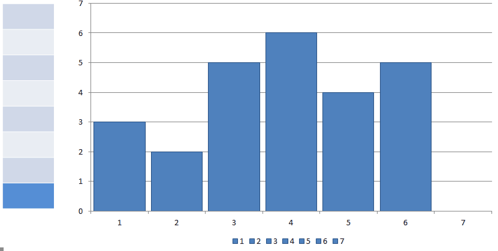
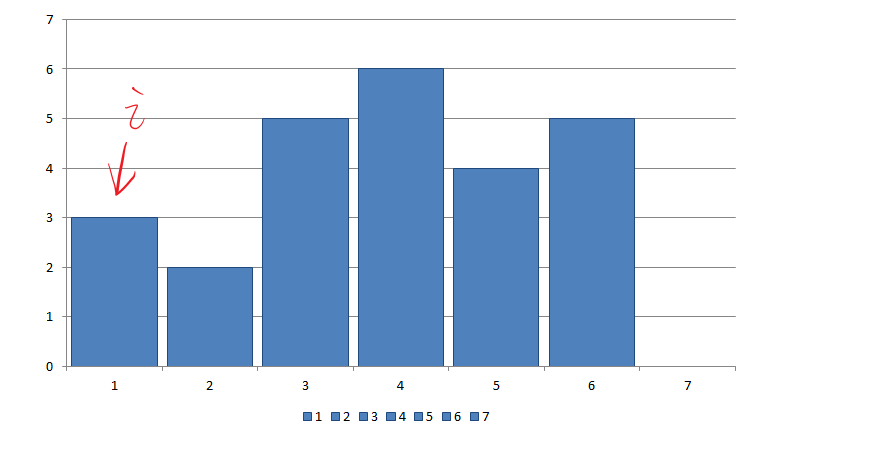
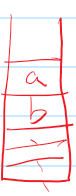

# Largest Rectangle

[题目](https://www.hackerrank.com/challenges/largest-rectangle/problem)  

**约束条件**



求的为面积，n*h[i]最长为10^11，需要用8字节大小来表示面积。

**变量含义：**  

n: 数组长度
h[i]: 高度

## Solution

**实现思路**  

涉及单调栈的使用：  
单调栈就是栈内元素单调递增或递减的栈。  
如单调递增的栈： 3 2 5 6 4 5:  
栈内变化：3 | 2 5 6 | 2 4 | 2 4 5  


若要求最大的矩形面积，可以说是求每个高度所能达到的最大面积，找出其中最大值。  
比如第i-1个元素，要求其高度h[i-1]的最大面积，需要找和它左边的、相邻的比它小的第一个值的索引j，然后找它右边的、相邻的、比它小的第一个值的索引k。 面积就为(k-j-1)*h[i-1]。  

若每个元素都左右遍历，复杂度为O(n^2)，所以用单调栈减少其中重复的操作。  
实现如图：



**注意点**  

* 在数组最后需要添加一个高度为0的元素。以便把栈内每个元素的面积都算出来。没加0的话程序不能完整结束。
* 若弹出元素后栈为空，说明当前元素前没有比它小的值，所以面积为i*h[stack.top()];
* 栈内可以存索引，方便计算长度，也可以方便地根据索引取得元素值

**变量设置**  

stack<int> rect_stk: 存的是元素索引。栈内两个相邻的元素值的含义是：在h数组中，从a位置开始，从右往左遍历，能找到的首个比h[a]小的值的索引为b  


**实现方式**  

```c
long largestrect_stkangle(vector<int> h) {
    if(h.empty()) return 0;
    //推入0，用于最后计算栈内数的最大面积
    h.push_back(0);

    //存索引
    stack<int> rect_stk;

    long sum = 0;
    long max = 0;

    //rect_stk[i-1]: 从右往左遍历，第一个比rect_stk.top()小的索引。
    for(int i = 0; i < h.size(); i++){
        while(!rect_stk.empty() && (h[i] < h[rect_stk.top()])){
            int top_idx =  rect_stk.top();
            rect_stk.pop();
            sum = h[top_idx] * (rect_stk.empty() ? i: (i-rect_stk.top()-1)); //!!rect_stk.empty()
            if(max < sum) max = sum;
        }
        rect_stk.push(i);
    }
    return max;
}
```
