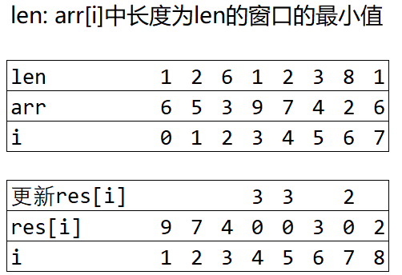

# Min Max Riddle
[题目](https://www.hackerrank.com/challenges/poisonous-plants/proble://www.hackerrank.com/challenges/min-max-riddle/problem?h_l=interview&playlist_slugs%5B%5D%5B%5D=interview-preparation-kit&playlist_slugs%5B%5D%5B%5D=stacks-queues)  
 
**实现思路**

法一: O(n):T(n) 
设置`res[j]`, 保存长度为j的窗口序列中的最大值。  
用单调栈找出`arr[i]`前后比它小的节点索引,`a`,`b`. 则arr[i]在长度为`len=b-a-1`的窗口中为最小值。
填好res[i]后发现有一些位置没有设置过。而通过观察知道`res[i]>=res[i+1]`，则通过`res[i] = max(res[i], res[i+1])` 赋值。



**实现方式**  

```c
#include <bits/stdc++.h>
using namespace std;

int main (int argc, char *argv[]) {
    int n;
    cin >> n;
    if( n <= 0){
        cout << "length is too short" << endl;
        return 0;
    }

    int arr[n] = {0};
    int i = 0;
    while(i < n){
        cin >> arr[i];
        ++i;
    }

    // res[i]: 长度为i的窗口的最大值。
    int res[n+1] = {0};

    // left[i]: arr[i]左边的且小于等于arr[i]的首个数字的索引
    // right[i]: arr[i]右边的且小于等于arr[i]的首个数字的索引
    int left[n] = {};
    int right[n] = {};

    for(i = 0; i < n; i++){
        left[i] = -1;
        right[i] = n;
    }

    stack<int> stk;
    for(i = 0; i < n; i++){ 
        while(!stk.empty() and arr[stk.top()] >= arr[i]) {
            stk.pop();
        }
        if(!stk.empty()) {
            left[i] = stk.top();
        }
        stk.push(i);
    }

    // stk记得清空！！！
    while(!stk.empty()){
        stk.pop();
    }

    for(i = n-1; i >= 0; i--){ 
        while(!stk.empty() and (arr[stk.top()] >= arr[i])) {
            stk.pop();
        }
        if(!stk.empty()) {
            right[i] = stk.top();
        }
        stk.push(i);
    }

    int len;
    for(i = 0; i < n; i++){ 
        len = right[i] - left[i] - 1;
        res[len] = max(res[len], arr[i]);
    }//[??1]会不会有没被赋值的

    //经观察，res[i]>=res[i+1], 因为范围越大的窗口的最小值去取最大值，肯定小于范围小的窗口的最小值中的最大值
    for(i = n-1; i >= 1; i--){ 
        res[i] = max(res[i], res[i+1]);
        //[x] if(res[i] == 0) res[i] = res[i+1];
    }

    for(i = 1; i <= n; i++){ 
        cout << res[i] << ' ';
    }
    cout << endl;

    return 0;
}
```

