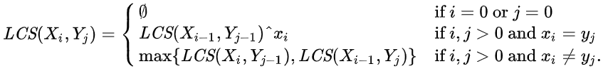
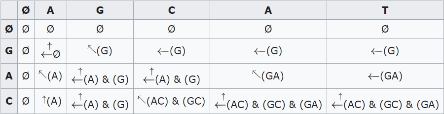
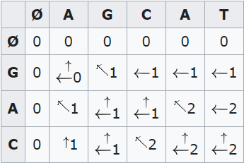
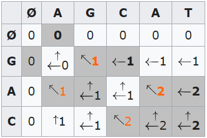

# Common Child

[题目](https://www.hackerrank.com/challenges/common-child/problem)  
该题主要是学习动态规划的思路. 用动态规划的题目有两个特点:  
1. 重叠子问题: 题目能被分成多个相似的子问题
2. 最优子结构性质: 问题的最优解可以由子问题的最优解得到

该题在维基上有词条专门解释该问题: [Longest common subsquence problem](https://en.wikipedia.org/wiki/Longest_common_subsequence_problem)

# Solution

**实现思路**  
O(m*n):  
实现是按照维基上的结构实现的:  
  
比如"XYZA"和"MNLA"问题, 他们最后一个字符都相等, 所以最长公共子序列为"A"+LCS("XYZ","MNL").  
所以实现步骤:  
若字符相等, 最长公共子序列=当前相等的字符 + 左上方值(子问题)  
若字符不等, 最长公共子序列=max(左方值,上方值)(子问题)  
  
本题只算长度, 所以保存数字即可.  
  
若要求具体子序列, 在问题规模较大的时候, 需要很多空间存储这些子字符串, 所以可以用`字符索引+方向`的结构来表示. 然后再读取出`箭头为斜上`的字符来构建子序列.  
  

**实现方式**  
```c
int arr[5000][5000]; //初始化为0
int LCS(string s1, string s2){
    for(int t = 0; t < s1.size(); t++){
        for(int s = 0; s < s2.size(); s++){
            int t_tmp = t;
            int s_tmp = s;
            //若 <0 , 先 ++, 后面 --. 省的写数组越界的判断语句, 统一代码.
            if(t-1 < 0) t_tmp++;
            if(s-1 < 0) s_tmp++;

            if(s1[t] == s2[s]){
                    arr[t][s] = arr[t_tmp-1][s_tmp-1] + 1; //[x]++
            }
            else{
                int n1 = arr[t_tmp-1][s];
                int n2 = arr[t][s_tmp-1];
                arr[t][s] = n1 > n2 ? n1 : n2;
            }
        }
    }
    return arr[s1.size()-1][s2.size()-1];
}

int commonChild(string s1, string s2) {
    return LCS(s1, s2);
}
```
