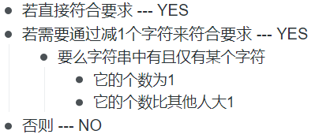

# Sherlock and the Valid String

[题目](https://www.hackerrank.com/challenges/sherlock-and-valid-string/problem)  
题目给定一字符串, 若能通过删除某个字符, 使得字符串中各字符的总数相同, 则返回"YES", 否则"NO"

# Solution

**实现思路**  
O(n):  


**实现方式**  
```c
string isValid(string s) {
    vector<int> letter(26);
    string ret = "NO";

    for(char c:s) letter[c-'a']++;

    //对字母计数 进行计数
    //-1 表示一开始就已经满足条件的情况
    for(int i = -1; i < 26; i++){
        if(i >= 0){
            if(letter[i] == 0) continue;
            letter[i]--;
        }

        unordered_set<char> cnt_cnt; //位置
        for(auto t: letter){
            if(t) cnt_cnt.insert(t); //if(t)
        }
        if(cnt_cnt.size() <= 1) ret = "YES";
        if(i >= 0) letter[i]++;
    }
    return ret;
}
```
