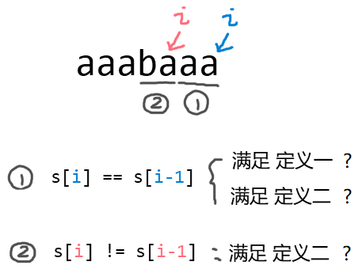

# Special String Again

[题目](https://www.hackerrank.com/challenges/special-palindrome-again/problem)  
题目要求计算出某字符串中的所有"特殊字符串", 满足如下任意一个定义:  
* 定义一: 字符全相同, e.g. aaaa
* 定义二: 除了中间字符, 其余全相同. e.g. aabaa

# Solution

**实现思路**  
* 若一个字符串字符全相同, 长度为n, 则所有子字符串为special string的个数为 1+2+...+n;
* 分成两种情况讨论:  


**实现方式**  
```c
long substrCount(int n, string s) {
    int mid_idx = -1; //中间字符的位置
    long cnt = n; //special string总数. 每个字符都满足定义, 因此初始化为n
    int consec = 1;//连续字符串长度

    for(int i = 1; i < n; i++){
        if(s[i] == s[i-1]){
            //n个连续字符,special string为 1 + 2 + ... + n-1 .
            cnt += consec;
            ++consec; 

            if(mid_idx != -1 ){
                //对称的点是否存在且相等
                if(s[i] == s[mid_idx-consec] and mid_idx-consec >= 0) ++cnt;
                else mid_idx =-1;
            }
        }
        else{
            consec = 1;
            if(i-2 >= 0 and s[i-2] == s[i]){
                ++cnt;
                mid_idx = i-1;
            }
            else mid_idx = -1;
        }
    }
    return cnt;
}
```
