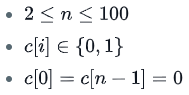

# Jumping on the Clouds

题目让我们跳云朵，其中有的是乌云不能踩。每次只能跳1或2格，问最少的跳数是多少。

**Function Description**

Complete the  _jumpingOnClouds_  function in the editor below. It should return the minimum number of jumps required, as an integer.

jumpingOnClouds has the following parameter(s):

-   _c_: an array of binary integers

**Input Format**

The first line contains an integer `n` , the total number of clouds. The second line contains  `n` space-separated binary integers describing clouds  `c[i]` where  `0<=i<n`.

**Constraints**



**Output Format**

Print the minimum number of jumps needed to win the game.

**Sample Input 0**

```
7
0 0 1 0 0 1 0
```

**Sample Output 0**

```
4
```

**Explanation 0:**
Emma must avoid  `c[2]` and `c[5]`  . She can win the game with a minimum of `4`  jumps:

**Solution**:

原则：能跳两格就跳两格，否则跳一格。
边界条件：到倒二个的时候停止。

```c
int jumpingOnClouds(vector<int> c) {
    int count = 0;
    vector<int>::iterator iter=c.begin();
    while(iter<c.end()-1) {
        if(iter+2 < c.end() && *(iter+2) == 0) iter+=2;
        else ++iter;
        ++count;
    }
    return count;
}
```
